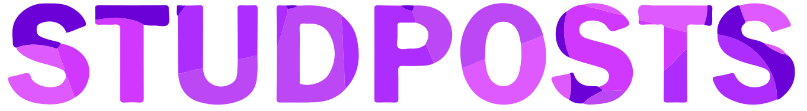
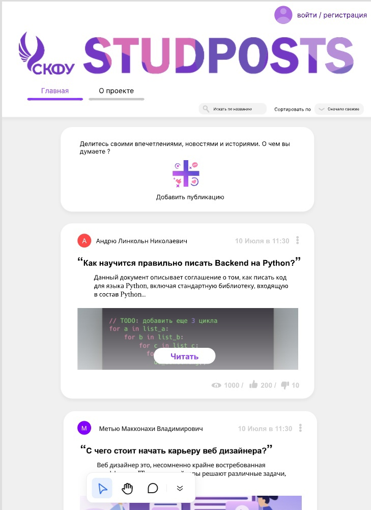

# STUDPOSTS-server

Cистема представляет собой веб-приложение на Python (Flask), 
содержащее ленту постов пользователей и их комментариев к ним.
Она использует PostgreSQL для хранения данных, JWT для аутентификации 
Незарегистрированные пользователи могут только просматривать посты и комментарии,
в то время как зарегистрированные пользователи также могут создавать посты, комментировать и ставить лайки. 
CAPTCHA используется для защиты от ботов при регистрации и входе

**Стек технологий:**

- Легковесный фреймворк **Python Flask**, который хорошо подходит для создания RESTful API.
- Микросервисная архитектура приложения;
- Проектирование с использованием ERD диаграмм, подключение реляционной базы данных **PostgreSQL**, использование в разработке тригеров, функций, процедур, определением сущностей и типов связей. Установление ограничений на выполнение операций пользователями базы данных, элементы теории нормализации данных;
- Создание интерфейсов программного взаимодействия (API);
- Коммандная работа в **Git** с использованием GitHub, markdown разметка для написания инструкции к проектам;
- Контейнеризация с использованием **Docker** и **Podman**, Создание образов, контейнеров, репозиториев DockerHUB, GitHUB Packages;
- Композ контейнеров с **Docker-compose** и podman-compose. Создание compose.yml файлов, обеспечение взаимодействия контейнеров в изолированном сетевом пространстве, без изоляции на одном сетевом уровне, выставление ограничений на память и использование вычислительных мощностей;
- Оркестрация контейнеров с **Kubernetes** дистрибуцией K3S. Создание и управление компонентов POD c использованием deployment, secret, service, configmap, statefullset. Управление кластером с использованием kubectl на мастер-ноде, декларативная запись yml, обеспечение доступности external services. Избыточность компонентов кластера, работе кластера в режиме балансировки нагрузки;
- Настройка **Nginx** для защиты от DoS, DDoS, XHR, CSRF, MITM, Buffer Overflow, SQL Injection атак, а также реализация обратного проксирования веб-сервера. Балансировка нагрузки, сборка nignx с использвоанием исходного кода и статичных модулей. Конфигурация nginx для использования HTTP v3 протокола. Кэширование, сжатие с использованием gzip;
- Установка и создание SSL сертификата с помощью Let's Encrypt,обеспечение защиты пользовательских данных;
- Логирование и мониторинг системы с использованием zabbix;
- Работа с токенами JWT для обеспечния дополнительного уровня защиты пользовательских данных;
- Деплой проекта, настройка Ubuntu для размещения проекта, подключение доменного имени;

Проект разработан студентами Северо-Кавказкого Федерального Университета кафедры Инфокоммуникаций в рамках девопс практики от Ростелекома

Обратная связь [wildcat2k21@gmail.com](mailto:wildcat2k21@gmail.com)
